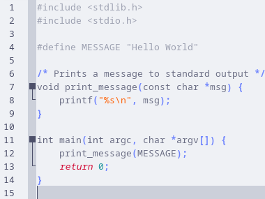
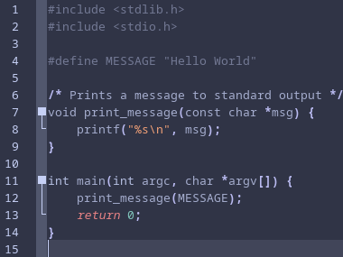
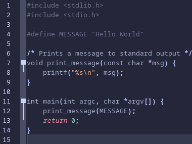
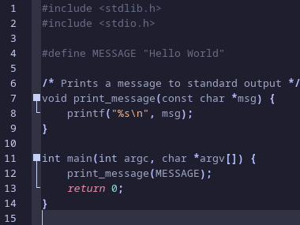

<h3 align="center">
	<br/>
	
	Catppuccin for <a href="https://github.com/geany/geany">Geany</a>
	
</h3>

<p align="center">
    <a href="https://github.com/catppuccin/geany/stargazers"></a>
    <a href="https://github.com/catppuccin/geany/issues"></a>
    <a href="https://github.com/catppuccin/geany/contributors"></a>
</p>

<p align="center">
  
</p>

## Previews

<details>
<summary>🌻 Latte</summary>

</details>
<details>
<summary>🪴 Frappé</summary>

</details>
<details>
<summary>🌺 Macchiato</summary>

</details>
<details>
<summary>🌿 Mocha</summary>

</details>

## Usage

### Installation

#### Manual <kbd>(Linux/MacOS)</kbd>

```bash
git clone https://github.com/catppuccin/geany
cd geany/src
mkdir ~/.config/geany/colorschemes/
cp *.conf ~/.config/geany/colorschemes/
```
#### Windows installation <kbd>(Manual)</kbd>
* Download or clone this repository (`git clone https://github.com/catppuccin/geany`)
* Open ***File Explorer*** as Administrator
* Go to the `src` folder then copy <kbd>catppuccin-*flavour*.conf</kbd> to `C:\Program Files\Geany\data\colorschemes\`

### Apply

1. Open Geany
2. Go to the `view` tab >> `Change color scheme` >> pick your desired `Catppuccin Flavour`

## 💝 Thanks to

-   [Waxxx333 ](https://github.com/Waxxx333)
-   [Isabelincorp ](https://github.com/isabelincorp)
&nbsp;

<p align="center"></p>
<p align="center">Copyright &copy; 2021-present <a href="https://github.com/catppuccin" target="_blank">Catppuccin Org</a>
<p align="center"><a href="https://github.com/catppuccin/catppuccin/blob/main/LICENSE"></a></p>
